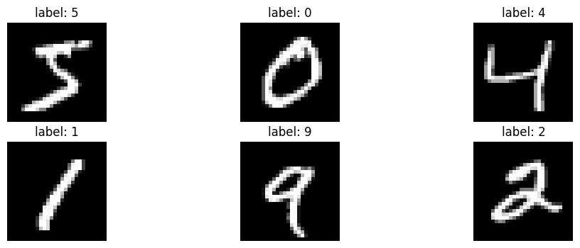
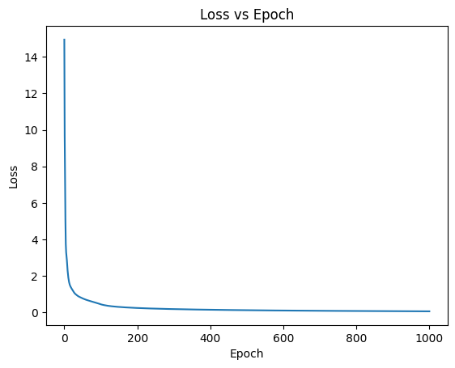
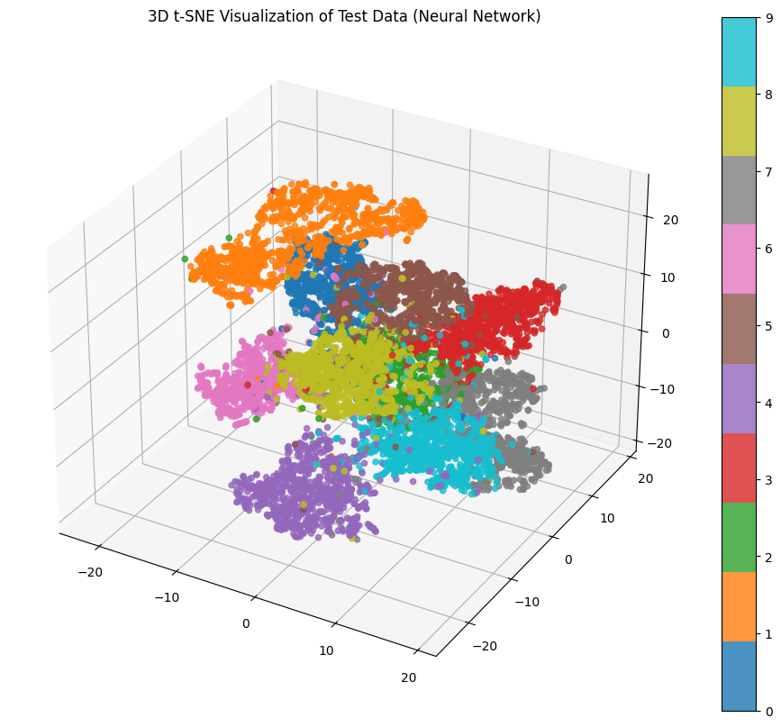
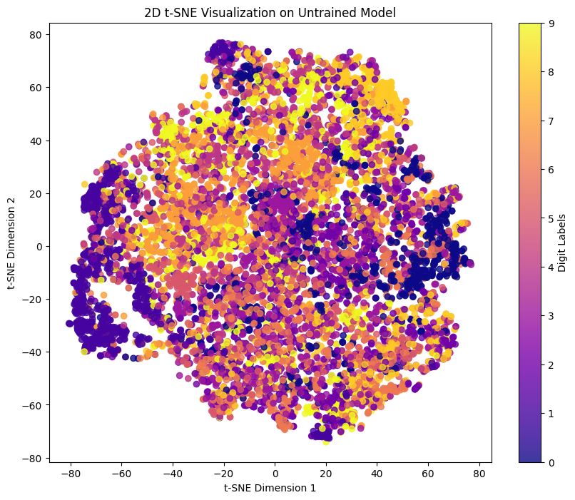
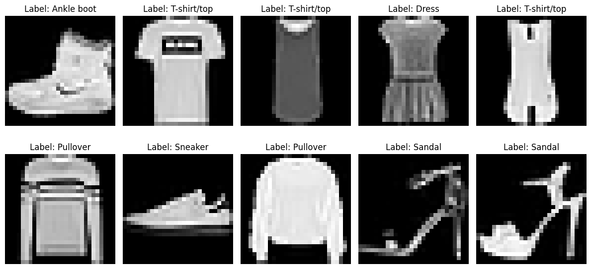

# MNIST Representation Learning & CNN Benchmark

A comparative study of **MLPs, classical ML models, CNNs, and pretrained CNNs** for image classification and representation learning on MNIST.



The project focuses on three questions:

* How does an MLP compare with classical classifiers?
* How does training change the learned feature space?
* How do CNNs compare in terms of accuracy, model size, and inference time?

---

## Results at a Glance

### MLP vs Classical Machine Learning

The MLP was benchmarked against Logistic Regression and Random Forest on MNIST.

| Model               |  Accuracy | Weighted F1 |
| ------------------- | --------: | ----------: |
| **Random Forest**   | **96.9%** |   **0.969** |
| MLP                 |     94.9% |       0.949 |
| Logistic Regression |     92.0% |       0.920 |



Random Forest performed best among the three models, while the MLP provided a learned feature representation that could be analyzed further.

---

## Representation Learning with t-SNE

The 20-neuron hidden layer of the MLP was used as a compact feature representation.

t-SNE was applied to visualize how the feature space changed before and after training.




After training, samples from the same digit form more distinct clusters, showing that the network learns a more class-structured representation.

This demonstrates that training changes not only the final classifier, but also the **geometry of the intermediate feature space**.

### Cross-Domain Generalization

The trained MNIST MLP was also evaluated on Fashion-MNIST without retraining.

**Fashion-MNIST accuracy: 6.84%**



Despite having the same image size and number of classes, Fashion-MNIST contains completely different visual patterns. The poor performance demonstrates that the learned representation is highly **domain-specific**.

---

## CNN Benchmark

A custom CNN was trained on MNIST and compared with pretrained MobileNetV2 and EfficientNet-B0.

| Model           |   Accuracy |   F1 Score | Parameters | Inference Time |
| --------------- | ---------: | ---------: | ---------: | -------------: |
| **Custom CNN**  | **98.52%** | **0.9852** |  **0.69M** |     **1.31 s** |
| MobileNetV2     |      9.42% |     0.0179 |      2.24M |       405.83 s |
| EfficientNet-B0 |      6.82% |     0.0371 |      4.02M |      1302.33 s |

The custom CNN achieved the highest accuracy while also being the smallest and fastest model in this experiment.

> **Transfer-learning note:** MobileNetV2 and EfficientNet-B0 were initialized with ImageNet-pretrained weights, but their final classification layers were replaced with randomly initialized 10-class layers and were **not fine-tuned on MNIST**. Their low accuracy therefore demonstrates the limitations of direct transfer without task-specific adaptation, rather than indicating that these architectures are inherently unsuitable for MNIST.

---

## CNN Error Analysis

The custom CNN achieved **98.52% accuracy** on the MNIST test set.

A confusion matrix was used to identify visually similar digits that were more difficult to distinguish.


---

## Model Architectures

### MLP

```text
784 input pixels
      ↓
Linear(784 → 30)
      ↓
ReLU
      ↓
Linear(30 → 20)
      ↓
ReLU
      ↓
Linear(20 → 10)
      ↓
Digit prediction
```

The **20-neuron layer** was used for representation analysis with t-SNE.

### Custom CNN

```text
1 × 28 × 28
     ↓
Conv2D: 32 filters, 3×3
     ↓
ReLU
     ↓
MaxPool
     ↓
Fully Connected: 128
     ↓
ReLU
     ↓
Fully Connected: 10
```

---

## Key Takeaways

* **Random Forest** outperformed the small MLP on MNIST, showing that model complexity alone does not guarantee better performance.
* Training transformed the MLP's hidden representation into a more clearly separated feature space.
* The MNIST-trained representation showed **poor cross-domain generalization** to Fashion-MNIST.
* The custom CNN achieved **98.52% accuracy**, outperforming the MLP by exploiting spatial structure in images.
* The custom CNN used significantly fewer parameters than MobileNetV2 and EfficientNet-B0.
* Pretrained CNNs require **task-specific adaptation or fine-tuning** to effectively transfer to a new domain.

---

## Repository Structure

```text
mnist-representation-learning-benchmark/
│
├── notebooks/
│   └── mnist_cnn_mlp_experiments.ipynb
│
├── results/
│   └── figures/
│       ├── mlp_comparison.png
│       ├── model_comparison.png
│       ├── tsne_trained_vs_untrained.png
│       ├── tsne_fashion_mnist.png
│       └── cnn_confusion_matrix.png
│
├── README.md
└── requirements.txt
```

---

## Running the Project

```bash
git clone https://github.com/<your-username>/mnist-representation-learning-benchmark.git
cd mnist-representation-learning-benchmark

python -m venv .venv
source .venv/bin/activate

pip install -r requirements.txt
jupyter notebook
```

Open:

```text
notebooks/mnist_cnn_mlp_experiments.ipynb
```

The MNIST and Fashion-MNIST datasets are downloaded automatically using `torchvision`.

---

## Tech Stack

**Python · PyTorch · Torchvision · Scikit-learn · NumPy · Matplotlib · Seaborn · t-SNE**

**Models:** MLP · Logistic Regression · Random Forest · CNN · MobileNetV2 · EfficientNet-B0

---

## Author

**Harshada Kale**

B.Tech Student | Machine Learning | Computer Vision | Robotics
